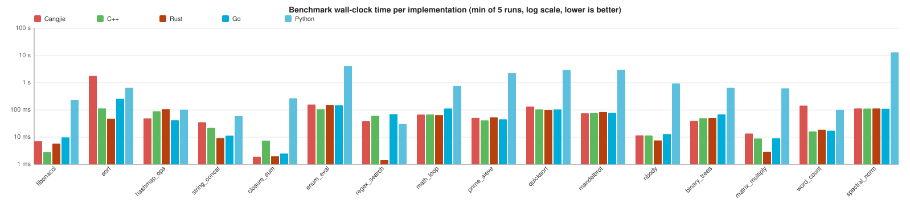

# CangjiePerf Benchmark Report

_Generated: 2026-04-25T15:28:31+00:00_

## Environment

- **OS**: Linux 6.17.0-1010-azure
- **Architecture**: x86_64
- **CPU**: AMD EPYC 7763 64-Core Processor
- **Python**: 3.12.3

## Toolchains

The benchmark suite compares **Cangjie** against four reference languages: **C++** and **Rust** as native-compiled baselines, **Go** as a managed-runtime compiled baseline, and **Python** as a scripting-language baseline. The exact toolchain versions used for this run are:

| Language | Available | Version |
|----------|-----------|---------|
| Cangjie | ✅ | Cangjie Compiler: 1.0.5 (cjnative) |
| C++ | ✅ | g++ (Ubuntu 13.3.0-6ubuntu2~24.04.1) 13.3.0 |
| Rust | ✅ | rustc 1.94.1 (e408947bf 2026-03-25) |
| Go | ✅ | go version go1.24.13 linux/amd64 |
| Python | ✅ | Python 3.12.3 |

## Run Configuration

- Warmup runs: **1**
- Measurement runs: **5**
- Languages enabled: **Cangjie, C++, Rust, Go, Python**
- Reported metric: per-process self-timed wall-clock (`ELAPSED_MS`); **`min`** chosen as the headline number, lower is better.

## Summary

| Benchmark | Category | Cangjie | C++ | Rust | Go | Python | Fastest |
|---|---|---|---|---|---|---|---|
| **fibonacci** | micro | 23.92 ms | 3.92 ms | 6.68 ms | 12.06 ms | 308.72 ms | C++ |
| **sort** ⚠️ | **micro** | **2.171 s** | **133.64 ms** | **56.08 ms** | **298.34 ms** | **794.80 ms** | **Rust** |
| **hashmap_ops** | micro | 503.66 ms | 134.13 ms | 132.19 ms | 60.50 ms | 119.16 ms | Go |
| **string_concat** | micro | 47.26 ms | 32.46 ms | 12.54 ms | 16.12 ms | 71.38 ms | Rust |
| **closure_sum** ⚠️ | **micro** | **102.07 ms** | **9.67 ms** | **1.55 ms** | **2.89 ms** | **357.86 ms** | **Rust** |
| **enum_eval** | micro | 516.12 ms | 129.12 ms | 193.13 ms | 174.10 ms | 5.245 s | C++ |
| **regex_search** ⚠️ | **micro** | **45.57 ms** | **77.69 ms** | **1.99 ms** | **100.83 ms** | **42.00 ms** | **Rust** |
| **math_loop** | micro | 140.76 ms | 86.05 ms | 84.40 ms | 144.27 ms | 916.04 ms | Rust |
| **prime_sieve** ⚠️ | **micro** | **1.609 s** | **55.81 ms** | **67.68 ms** | **59.64 ms** | **2.829 s** | **C++** |
| **quicksort** ⚠️ | **micro** | **2.265 s** | **111.62 ms** | **116.12 ms** | **120.96 ms** | **3.607 s** | **C++** |
| **mandelbrot** | apps | 251.74 ms | 90.86 ms | 91.70 ms | 91.22 ms | 3.455 s | C++ |
| **nbody** | apps | 78.90 ms | 13.84 ms | 9.19 ms | 14.99 ms | 1.162 s | Rust |
| **binary_trees** | apps | 115.89 ms | 67.13 ms | 65.73 ms | 92.91 ms | 847.46 ms | Rust |
| **matrix_multiply** ⚠️ | **apps** | **884.58 ms** | **10.35 ms** | **3.76 ms** | **10.43 ms** | **725.68 ms** | **Rust** |
| **word_count** ⚠️ | **apps** | **723.62 ms** | **27.23 ms** | **25.99 ms** | **25.11 ms** | **134.97 ms** | **Go** |
| **spectral_norm** ⚠️ | **apps** | **2.230 s** | **128.76 ms** | **129.41 ms** | **129.59 ms** | **15.475 s** | **C++** |

> **Bold rows** marked with ⚠️ are benchmarks where Cangjie's timing is closer (in log scale) to Python's than to C++'s — i.e. cases where the Cangjie implementation is significantly under-performing the native baseline. See [`analyse.md`](./analyse.md) for the root-cause analysis.

### Visual comparison

Each benchmark shows five side-by-side bars (Cangjie / C++ / Rust / Go / Python). **Lower bars are faster.** Note the **logarithmic** y-axis: a one-step gridline difference is a 10× speed difference. Open the SVG in a new tab to see exact per-bar tooltips.

## Per-benchmark Detail

### fibonacci — Recursive Fibonacci (function call / recursion)

_Category_: `micro` &nbsp;&nbsp;_Args_: `32`

Pure recursive fib(N). Stresses function-call overhead and integer arithmetic. No standard-library involvement beyond integers.

| Language | Status | min | median | mean | stddev | vs fastest | Checksum |
|----------|--------|-----|--------|------|--------|------------|----------|
| Cangjie | ✅ | 23.92 ms | 23.97 ms | 23.95 ms | 26.12 µs | 6.10× | `2178309` |
| C++ | ✅ | 3.92 ms | 3.97 ms | 4.05 ms | 213.49 µs | 1.00× | `2178309` |
| Rust | ✅ | 6.68 ms | 6.75 ms | 6.83 ms | 227.36 µs | 1.70× | `2178309` |
| Go | ✅ | 12.06 ms | 12.11 ms | 12.35 ms | 490.74 µs | 3.08× | `2178309` |
| Python | ✅ | 308.72 ms | 312.64 ms | 312.88 ms | 2.74 ms | 78.78× | `2178309` |

### sort — Sort 2M integers (stdlib sort)

_Category_: `micro` &nbsp;&nbsp;_Args_: `2000000`

Generate 2,000,000 deterministic pseudo-random Int64 values then sort ascending using the language's standard sort. Stresses standard library sorting and dynamic arrays.

| Language | Status | min | median | mean | stddev | vs fastest | Checksum |
|----------|--------|-----|--------|------|--------|------------|----------|
| Cangjie | ✅ | 2.171 s | 2.200 s | 2.195 s | 15.26 ms | 38.71× | `1074570229` |
| C++ | ✅ | 133.64 ms | 134.00 ms | 133.99 ms | 222.66 µs | 2.38× | `1074570229` |
| Rust | ✅ | 56.08 ms | 56.32 ms | 56.28 ms | 137.27 µs | 1.00× | `1074570229` |
| Go | ✅ | 298.34 ms | 298.75 ms | 298.73 ms | 244.95 µs | 5.32× | `1074570229` |
| Python | ✅ | 794.80 ms | 836.33 ms | 837.15 ms | 28.13 ms | 14.17× | `1074570229` |

### hashmap_ops — HashMap insert + lookup (stdlib hash table)

_Category_: `micro` &nbsp;&nbsp;_Args_: `500000`

Insert N (string,int) pairs then look up the same N keys. Stresses hash maps, string hashing, and string allocation.

| Language | Status | min | median | mean | stddev | vs fastest | Checksum |
|----------|--------|-----|--------|------|--------|------------|----------|
| Cangjie | ✅ | 503.66 ms | 516.03 ms | 513.75 ms | 9.58 ms | 8.33× | `0` |
| C++ | ✅ | 134.13 ms | 135.80 ms | 136.29 ms | 2.17 ms | 2.22× | `0` |
| Rust | ✅ | 132.19 ms | 136.66 ms | 141.79 ms | 10.62 ms | 2.19× | `0` |
| Go | ✅ | 60.50 ms | 61.69 ms | 65.61 ms | 6.87 ms | 1.00× | `0` |
| Python | ✅ | 119.16 ms | 119.93 ms | 120.42 ms | 1.31 ms | 1.97× | `0` |

### string_concat — String building (stdlib StringBuilder)

_Category_: `micro` &nbsp;&nbsp;_Args_: `500000`

Build a single large string from N small fragments using the recommended efficient builder for each language. Stresses string buffers and memory growth.

| Language | Status | min | median | mean | stddev | vs fastest | Checksum |
|----------|--------|-----|--------|------|--------|------------|----------|
| Cangjie | ✅ | 47.26 ms | 47.34 ms | 47.48 ms | 275.07 µs | 3.77× | `5388890` |
| C++ | ✅ | 32.46 ms | 33.20 ms | 33.08 ms | 414.84 µs | 2.59× | `5388890` |
| Rust | ✅ | 12.54 ms | 12.66 ms | 12.64 ms | 57.86 µs | 1.00× | `5388890` |
| Go | ✅ | 16.12 ms | 16.57 ms | 16.51 ms | 264.79 µs | 1.29× | `5388890` |
| Python | ✅ | 71.38 ms | 72.65 ms | 72.42 ms | 735.21 µs | 5.69× | `5388890` |

### closure_sum — Closure / higher-order pipeline

_Category_: `micro` &nbsp;&nbsp;_Args_: `2000000`

Apply a map -> filter -> reduce pipeline of closures over N integers. Stresses higher-order function dispatch, closure allocation, and integer arithmetic.

| Language | Status | min | median | mean | stddev | vs fastest | Checksum |
|----------|--------|-----|--------|------|--------|------------|----------|
| Cangjie | ✅ | 102.07 ms | 102.56 ms | 102.52 ms | 279.93 µs | 65.78× | `1777776444435777780` |
| C++ | ✅ | 9.67 ms | 9.69 ms | 9.70 ms | 26.77 µs | 6.23× | `1777776444435777780` |
| Rust | ✅ | 1.55 ms | 1.62 ms | 1.64 ms | 91.66 µs | 1.00× | `1777776444435777780` |
| Go | ✅ | 2.89 ms | 2.90 ms | 3.00 ms | 146.09 µs | 1.87× | `1777776444435777780` |
| Python | ✅ | 357.86 ms | 358.65 ms | 359.09 ms | 1.45 ms | 230.64× | `1777776444435777780` |

### enum_eval — Enum / pattern matching (AST evaluation)

_Category_: `micro` &nbsp;&nbsp;_Args_: `18 60`

Build a recursive arithmetic expression tree of depth D and evaluate it N times via recursive pattern matching on a sum-type enum (Num | Add | Sub | Mul). Stresses algebraic data types, recursive calls, and tag dispatch.

| Language | Status | min | median | mean | stddev | vs fastest | Checksum |
|----------|--------|-----|--------|------|--------|------------|----------|
| Cangjie | ✅ | 516.12 ms | 546.29 ms | 538.97 ms | 14.77 ms | 4.00× | `0` |
| C++ | ✅ | 129.12 ms | 129.42 ms | 129.71 ms | 737.81 µs | 1.00× | `0` |
| Rust | ✅ | 193.13 ms | 195.60 ms | 195.26 ms | 2.05 ms | 1.50× | `0` |
| Go | ✅ | 174.10 ms | 174.83 ms | 175.03 ms | 1.05 ms | 1.35× | `0` |
| Python | ✅ | 5.245 s | 5.270 s | 5.281 s | 30.41 ms | 40.62× | `0` |

### regex_search — Regex find-all (stdlib regex)

_Category_: `micro` &nbsp;&nbsp;_Args_: `4000`

Run a non-trivial alternation regex (date | email | capitalized word) across REPEATS copies of a sample paragraph. Stresses the standard regex engine.

| Language | Status | min | median | mean | stddev | vs fastest | Checksum |
|----------|--------|-----|--------|------|--------|------------|----------|
| Cangjie | ✅ | 45.57 ms | 45.90 ms | 45.99 ms | 339.24 µs | 22.91× | `36000` |
| C++ | ✅ | 77.69 ms | 77.75 ms | 82.99 ms | 11.54 ms | 39.05× | `36000` |
| Rust | ✅ | 1.99 ms | 2.13 ms | 2.31 ms | 532.51 µs | 1.00× | `36000` |
| Go | ✅ | 100.83 ms | 102.87 ms | 102.52 ms | 1.57 ms | 50.69× | `36000` |
| Python | ✅ | 42.00 ms | 42.19 ms | 42.32 ms | 399.95 µs | 21.11× | `36000` |

### math_loop — Math-intensive loop (sin/cos/sqrt/exp)

_Category_: `micro` &nbsp;&nbsp;_Args_: `5000000`

Sum sin(x)*cos(x)+sqrt(x+1)-exp(-x) over N points. Stresses the math standard library and floating-point throughput.

| Language | Status | min | median | mean | stddev | vs fastest | Checksum |
|----------|--------|-----|--------|------|--------|------------|----------|
| Cangjie | ✅ | 140.76 ms | 140.91 ms | 140.89 ms | 76.67 µs | 1.67× | `4704337083537` |
| C++ | ✅ | 86.05 ms | 86.25 ms | 86.22 ms | 149.19 µs | 1.02× | `4704337083537` |
| Rust | ✅ | 84.40 ms | 84.65 ms | 84.69 ms | 239.59 µs | 1.00× | `4704337083537` |
| Go | ✅ | 144.27 ms | 144.49 ms | 144.80 ms | 621.87 µs | 1.71× | `4704337083537` |
| Python | ✅ | 916.04 ms | 917.74 ms | 919.28 ms | 3.40 ms | 10.85× | `4704337083537` |

### prime_sieve — Sieve of Eratosthenes

_Category_: `micro` &nbsp;&nbsp;_Args_: `20000000`

Classic Sieve of Eratosthenes up to N on a one-byte-per-cell boolean array, then count primes and sum them mod 2^31. Algorithmically identical across all three languages: same loop bounds, same inner stride, same checksum formula.

| Language | Status | min | median | mean | stddev | vs fastest | Checksum |
|----------|--------|-----|--------|------|--------|------------|----------|
| Cangjie | ✅ | 1.609 s | 1.648 s | 1.635 s | 21.36 ms | 28.83× | `1156745585` |
| C++ | ✅ | 55.81 ms | 56.16 ms | 56.13 ms | 249.45 µs | 1.00× | `1156745585` |
| Rust | ✅ | 67.68 ms | 68.72 ms | 68.64 ms | 846.82 µs | 1.21× | `1156745585` |
| Go | ✅ | 59.64 ms | 59.85 ms | 60.33 ms | 799.72 µs | 1.07× | `1156745585` |
| Python | ✅ | 2.829 s | 2.855 s | 2.851 s | 15.34 ms | 50.69× | `1156745585` |

### quicksort — Hand-written quicksort

_Category_: `micro` &nbsp;&nbsp;_Args_: `1500000`

Lomuto-partition quicksort with middle-element pivot and recurse-smaller-side / iterate-larger-side, implemented by hand in all three languages so the algorithm itself is identical (complements the stdlib `sort` benchmark).

| Language | Status | min | median | mean | stddev | vs fastest | Checksum |
|----------|--------|-----|--------|------|--------|------------|----------|
| Cangjie | ✅ | 2.265 s | 2.326 s | 2.311 s | 43.27 ms | 20.29× | `612429648` |
| C++ | ✅ | 111.62 ms | 111.89 ms | 111.80 ms | 144.31 µs | 1.00× | `612429648` |
| Rust | ✅ | 116.12 ms | 116.17 ms | 116.71 ms | 1.13 ms | 1.04× | `612429648` |
| Go | ✅ | 120.96 ms | 121.08 ms | 121.16 ms | 204.70 µs | 1.08× | `612429648` |
| Python | ✅ | 3.607 s | 3.714 s | 3.701 s | 88.92 ms | 32.31× | `612429648` |

### mandelbrot — Mandelbrot set (numerical kernel)

_Category_: `apps` &nbsp;&nbsp;_Args_: `600 200`

Compute a Mandelbrot escape-time bitmap of size W*W with up to MAX_ITER iterations. Inspired by the Computer Language Benchmarks Game. Stresses tight numeric loops and floating-point arithmetic.

| Language | Status | min | median | mean | stddev | vs fastest | Checksum |
|----------|--------|-----|--------|------|--------|------------|----------|
| Cangjie | ✅ | 251.74 ms | 251.93 ms | 251.90 ms | 124.13 µs | 2.77× | `29624109` |
| C++ | ✅ | 90.86 ms | 90.87 ms | 90.88 ms | 31.68 µs | 1.00× | `29624109` |
| Rust | ✅ | 91.70 ms | 91.73 ms | 91.76 ms | 72.75 µs | 1.01× | `29624109` |
| Go | ✅ | 91.22 ms | 91.31 ms | 91.31 ms | 67.66 µs | 1.00× | `29624109` |
| Python | ✅ | 3.455 s | 3.490 s | 4.664 s | 2.656 s | 38.02× | `29624109` |

### nbody — N-Body simulation (numerical kernel)

_Category_: `apps` &nbsp;&nbsp;_Args_: `200000`

Symplectic integrator for the classic 5-body solar system from the Benchmarks Game over N steps. Stresses tight floating-point loops and array indexing.

| Language | Status | min | median | mean | stddev | vs fastest | Checksum |
|----------|--------|-----|--------|------|--------|------------|----------|
| Cangjie | ✅ | 78.90 ms | 79.01 ms | 80.56 ms | 2.20 ms | 8.59× | `-169083713` |
| C++ | ✅ | 13.84 ms | 14.14 ms | 14.13 ms | 230.87 µs | 1.51× | `-169083713` |
| Rust | ✅ | 9.19 ms | 9.24 ms | 9.34 ms | 182.54 µs | 1.00× | `-169083713` |
| Go | ✅ | 14.99 ms | 15.51 ms | 15.41 ms | 238.70 µs | 1.63× | `-169083713` |
| Python | ✅ | 1.162 s | 1.185 s | 1.196 s | 36.68 ms | 126.49× | `-169083713` |

### binary_trees — Binary trees (allocation / GC pressure)

_Category_: `apps` &nbsp;&nbsp;_Args_: `14`

Build and check many small balanced binary trees up to depth D. Adapted from the Computer Language Benchmarks Game. Stresses small-object allocation and GC (or heap allocator).

| Language | Status | min | median | mean | stddev | vs fastest | Checksum |
|----------|--------|-----|--------|------|--------|------------|----------|
| Cangjie | ✅ | 115.89 ms | 120.52 ms | 119.94 ms | 2.38 ms | 1.76× | `13250584224` |
| C++ | ✅ | 67.13 ms | 67.31 ms | 67.45 ms | 356.77 µs | 1.02× | `13250584224` |
| Rust | ✅ | 65.73 ms | 66.45 ms | 66.85 ms | 1.66 ms | 1.00× | `13250584224` |
| Go | ✅ | 92.91 ms | 93.73 ms | 93.87 ms | 921.14 µs | 1.41× | `13250584224` |
| Python | ✅ | 847.46 ms | 854.44 ms | 853.28 ms | 3.94 ms | 12.89× | `13250584224` |

### matrix_multiply — Matrix multiplication (naive O(N^3))

_Category_: `apps` &nbsp;&nbsp;_Args_: `250`

Compute C = A * B for two NxN double-precision matrices using the textbook triple-loop algorithm. Stresses memory layout, FP multiply-add throughput, and cache behaviour.

| Language | Status | min | median | mean | stddev | vs fastest | Checksum |
|----------|--------|-----|--------|------|--------|------------|----------|
| Cangjie | ✅ | 884.58 ms | 892.54 ms | 898.69 ms | 15.54 ms | 235.48× | `15315135000` |
| C++ | ✅ | 10.35 ms | 11.00 ms | 10.91 ms | 317.66 µs | 2.76× | `15315135000` |
| Rust | ✅ | 3.76 ms | 3.83 ms | 3.94 ms | 300.69 µs | 1.00× | `15315135000` |
| Go | ✅ | 10.43 ms | 11.41 ms | 11.22 ms | 444.35 µs | 2.78× | `15315135000` |
| Python | ✅ | 725.68 ms | 728.72 ms | 737.71 ms | 23.14 ms | 193.18× | `15315135000` |

### word_count — Word count (text processing)

_Category_: `apps` &nbsp;&nbsp;_Args_: `1000000`

Tokenize a synthesized N-word text and count word frequencies in a hash-map. Stresses string slicing/comparison, hashing, and hash-map updates — a typical scripting workload.

| Language | Status | min | median | mean | stddev | vs fastest | Checksum |
|----------|--------|-----|--------|------|--------|------------|----------|
| Cangjie | ✅ | 723.62 ms | 729.08 ms | 733.48 ms | 10.88 ms | 28.81× | `638309952` |
| C++ | ✅ | 27.23 ms | 27.80 ms | 27.76 ms | 409.41 µs | 1.08× | `638309952` |
| Rust | ✅ | 25.99 ms | 26.08 ms | 26.10 ms | 97.30 µs | 1.03× | `638309952` |
| Go | ✅ | 25.11 ms | 25.35 ms | 25.38 ms | 213.80 µs | 1.00× | `638309952` |
| Python | ✅ | 134.97 ms | 135.46 ms | 135.34 ms | 328.61 µs | 5.37× | `638309952` |

### spectral_norm — Spectral norm (CLBG numerical kernel)

_Category_: `apps` &nbsp;&nbsp;_Args_: `1500`

Approximates the largest eigenvalue of an infinite matrix A[i][j] = 1 / ((i+j)(i+j+1)/2 + i + 1) via 10 power iterations of v <- A^T A v. Adapted from the Computer Language Benchmarks Game; algorithmically identical across all three languages.

| Language | Status | min | median | mean | stddev | vs fastest | Checksum |
|----------|--------|-----|--------|------|--------|------------|----------|
| Cangjie | ✅ | 2.230 s | 2.234 s | 2.244 s | 17.18 ms | 17.32× | `1274224151` |
| C++ | ✅ | 128.76 ms | 128.90 ms | 128.85 ms | 70.74 µs | 1.00× | `1274224151` |
| Rust | ✅ | 129.41 ms | 129.58 ms | 129.57 ms | 119.19 µs | 1.01× | `1274224151` |
| Go | ✅ | 129.59 ms | 129.77 ms | 129.76 ms | 169.07 µs | 1.01× | `1274224151` |
| Python | ✅ | 15.475 s | 15.536 s | 15.606 s | 163.98 ms | 120.19× | `1274224151` |

## Methodology

- Each implementation is invoked as a fresh OS process and measures its own hot-path execution using a monotonic clock, printing `ELAPSED_MS:<value>`. This excludes interpreter / runtime startup from the measurement.
- Each implementation also prints `CHECKSUM:<value>` of its computed result; the runner verifies all implementations of the same benchmark agree, otherwise the comparison is flagged as invalid.
- Per benchmark we run `warmup` unmeasured iterations, then `iterations` measured iterations and report **min / median / mean / stddev**. The _min_ is used for the headline ratio because it is the most robust estimate of best-case wall-clock cost when other system noise is present.
- Compiler flags: `g++ -O2 -std=c++17` for C++, `rustc -O --edition=2021` (release-equivalent ``opt-level=3``) for Rust, `go build` (default release optimization) for Go, `cjpm build` for Cangjie (each benchmark's `cjpm.toml` sets `[profile.build] compile-option = "-O2"`), CPython 3 for Python (no `-O`), all with no extra runtime tuning.
