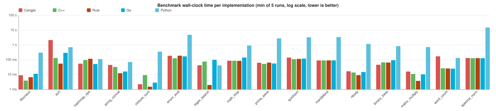
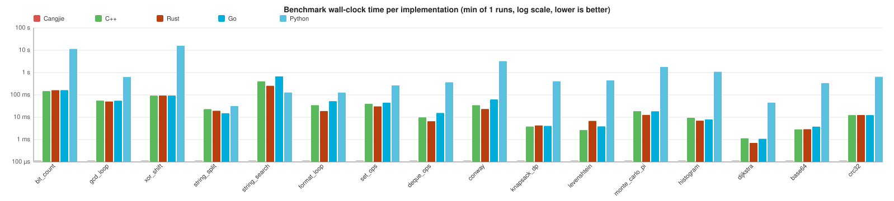

# CangjiePerf Benchmark Report

_Generated: 2026-04-26T03:55:57+00:00_

## Environment

- **OS**: Linux 6.17.0-1010-azure
- **Architecture**: x86_64
- **CPU**: AMD EPYC 7763 64-Core Processor
- **Python**: 3.12.3

## Toolchains

The benchmark suite compares **Cangjie** against four reference languages: **C++** and **Rust** as native-compiled baselines, **Go** as a managed-runtime compiled baseline, and **Python** as a scripting-language baseline. The exact toolchain versions used for this run are:

| Language | Available | Version |
|----------|-----------|---------|
| Cangjie | ✅ | Cangjie Compiler: 1.0.5 (cjnative) |
| C++ | ✅ | g++ (Ubuntu 13.3.0-6ubuntu2~24.04.1) 13.3.0 |
| Rust | ✅ | rustc 1.94.1 (e408947bf 2026-03-25) |
| Go | ✅ | go version go1.24.13 linux/amd64 |
| Python | ✅ | Python 3.12.3 |

## Run Configuration

- Warmup runs: **1**
- Measurement runs: **5**
- Languages enabled: **Cangjie, C++, Rust, Go, Python**
- Reported metric: per-process self-timed wall-clock (`ELAPSED_MS`); **`min`** chosen as the headline number, lower is better.

## Summary

| Benchmark | Category | Cangjie | C++ | Rust | Go | Python | Fastest |
|---|---|---|---|---|---|---|---|
| **fibonacci** | micro | 9.03 ms | 3.94 ms | 6.67 ms | 11.40 ms | 307.12 ms | C++ |
| **sort** ⚠️ | **micro** | **2.165 s** | **133.48 ms** | **55.32 ms** | **297.16 ms** | **708.71 ms** | **Rust** |
| **hashmap_ops** | micro | 55.12 ms | 96.30 ms | 117.86 ms | 51.97 ms | 111.60 ms | Go |
| **string_concat** | micro | 44.80 ms | 32.78 ms | 12.48 ms | 16.26 ms | 70.75 ms | Rust |
| **closure_sum** | micro | 2.24 ms | 9.21 ms | 1.53 ms | 2.89 ms | 356.57 ms | Rust |
| **enum_eval** | micro | 187.47 ms | 126.50 ms | 190.14 ms | 171.39 ms | 4.883 s | C++ |
| **regex_search** | micro | 42.98 ms | 76.88 ms | 2.01 ms | 100.28 ms | 41.91 ms | **Rust** |
| **math_loop** | micro | 87.11 ms | 86.68 ms | 84.98 ms | 144.22 ms | 925.80 ms | Rust |
| **prime_sieve** | micro | 63.36 ms | 53.11 ms | 64.70 ms | 56.49 ms | 2.814 s | C++ |
| **quicksort** | micro | 141.75 ms | 111.33 ms | 115.64 ms | 121.08 ms | 3.346 s | C++ |
| **mandelbrot** | apps | 90.39 ms | 90.76 ms | 91.42 ms | 91.08 ms | 3.445 s | Cangjie |
| **nbody** | apps | 16.80 ms | 13.89 ms | 9.20 ms | 14.95 ms | 1.177 s | Rust |
| **binary_trees** | apps | 46.31 ms | 67.36 ms | 65.48 ms | 93.80 ms | 838.74 ms | Cangjie |
| **matrix_multiply** | apps | 16.15 ms | 11.02 ms | 3.78 ms | 10.44 ms | 728.50 ms | Rust |
| **word_count** ⚠️ | **apps** | **173.10 ms** | **27.05 ms** | **25.96 ms** | **25.20 ms** | **134.37 ms** | **Go** |
| **spectral_norm** | apps | 133.35 ms | 128.96 ms | 129.60 ms | 129.30 ms | 15.280 s | C++ |
| **bit_count** | micro | 164.07 ms | 148.99 ms | 163.09 ms | 163.62 ms | 11.258 s | C++ |
| **gcd_loop** | micro | 50.09 ms | 55.47 ms | 50.47 ms | 55.16 ms | 626.67 ms | Cangjie |
| **xor_shift** | micro | 93.46 ms | 93.61 ms | 93.61 ms | 93.60 ms | 15.635 s | Cangjie |
| **string_split** | micro | 20.65 ms | 23.13 ms | 19.42 ms | 14.43 ms | 31.59 ms | Go |
| **string_search** | micro | 97.58 ms | 399.07 ms | 254.62 ms | 676.77 ms | 128.02 ms | Cangjie |
| **format_loop** ⚠️ | **micro** | **69.41 ms** | **33.71 ms** | **18.30 ms** | **50.73 ms** | **125.25 ms** | **Rust** |
| **set_ops** | micro | 17.01 ms | 38.83 ms | 29.98 ms | 36.09 ms | 236.11 ms | Cangjie |
| **deque_ops** | micro | 6.81 ms | 8.53 ms | 6.60 ms | 15.42 ms | 367.71 ms | Rust |
| **conway** | apps | 35.69 ms | 34.52 ms | 22.82 ms | 62.82 ms | 3.256 s | Rust |
| **knapsack_dp** | apps | 5.32 ms | 3.80 ms | 4.14 ms | 4.14 ms | 412.62 ms | C++ |
| **levenshtein** | apps | 3.86 ms | 2.44 ms | 6.68 ms | 3.55 ms | 440.39 ms | C++ |
| **monte_carlo_pi** | apps | 20.70 ms | 18.78 ms | 12.62 ms | 18.33 ms | 1.763 s | Rust |
| **histogram** | apps | 7.95 ms | 9.36 ms | 7.03 ms | 7.88 ms | 1.050 s | Rust |
| **dijkstra** | apps | 1.18 ms | 978.23 µs | 697.07 µs | 972.77 µs | 41.92 ms | Rust |
| **base64** | apps | 4.68 ms | 2.72 ms | 2.80 ms | 3.64 ms | 333.36 ms | C++ |
| **crc32** | apps | 14.69 ms | 12.47 ms | 12.51 ms | 12.51 ms | 586.59 ms | C++ |

> **Bold rows** marked with ⚠️ are benchmarks where Cangjie's timing is closer (in log scale) to Python's than to C++'s — i.e. cases where the Cangjie implementation is significantly under-performing the native baseline. See [`analyse.md`](./analyse.md) for the root-cause analysis.

### Visual comparison

Each benchmark shows five side-by-side bars (Cangjie / C++ / Rust / Go / Python). **Lower bars are faster.** Note the **logarithmic** y-axis: a one-step gridline difference is a 10× speed difference. Open an SVG in a new tab to see exact per-bar tooltips.

**All benchmarks (combined):**

The benchmark catalog is split into two groups for easier side-by-side reading:

1. **Core** (the original 16 benchmarks) — recursion, sort, stdlib hash-map, string builder, closures, enum / pattern matching, regex, math loop, prime sieve, hand-written quicksort, Mandelbrot, n-body, binary trees, matrix multiply, word count, spectral norm.
2. **Extended** (the additional 16 benchmarks) — popcount loop, GCD loop, xorshift64 PRNG, stdlib `split`/`indexOf`, integer formatting, `HashSet` ops, dynamic-array push/pop, Conway's Game of Life, 0/1 knapsack DP, Levenshtein DP, integer Monte Carlo PI, histogram bucketing, dense-graph Dijkstra, base64 encode, CRC32.

**Core benchmarks:**

**Extended benchmarks:**

## Per-benchmark Detail

### fibonacci — Recursive Fibonacci (function call / recursion)

_Category_: `micro` &nbsp;&nbsp;_Args_: `32`

Pure recursive fib(N). Stresses function-call overhead and integer arithmetic. No standard-library involvement beyond integers.

| Language | Status | min | median | mean | stddev | vs fastest | Checksum |
|----------|--------|-----|--------|------|--------|------------|----------|
| Cangjie | ✅ | 9.03 ms | 9.30 ms | 9.25 ms | 127.05 µs | 2.29× | `2178309` |
| C++ | ✅ | 3.94 ms | 3.99 ms | 4.08 ms | 227.30 µs | 1.00× | `2178309` |
| Rust | ✅ | 6.67 ms | 6.68 ms | 6.95 ms | 371.54 µs | 1.70× | `2178309` |
| Go | ✅ | 11.40 ms | 11.54 ms | 11.74 ms | 367.41 µs | 2.90× | `2178309` |
| Python | ✅ | 307.12 ms | 309.67 ms | 308.98 ms | 1.70 ms | 78.00× | `2178309` |

### sort — Sort 2M integers (stdlib sort)

_Category_: `micro` &nbsp;&nbsp;_Args_: `2000000`

Generate 2,000,000 deterministic pseudo-random Int64 values then sort ascending using the language's standard sort. Stresses standard library sorting and dynamic arrays.

| Language | Status | min | median | mean | stddev | vs fastest | Checksum |
|----------|--------|-----|--------|------|--------|------------|----------|
| Cangjie | ✅ | 2.165 s | 2.186 s | 2.186 s | 16.20 ms | 39.13× | `1074570229` |
| C++ | ✅ | 133.48 ms | 133.65 ms | 134.19 ms | 1.31 ms | 2.41× | `1074570229` |
| Rust | ✅ | 55.32 ms | 55.44 ms | 55.49 ms | 143.20 µs | 1.00× | `1074570229` |
| Go | ✅ | 297.16 ms | 297.71 ms | 297.70 ms | 462.61 µs | 5.37× | `1074570229` |
| Python | ✅ | 708.71 ms | 710.64 ms | 714.97 ms | 11.00 ms | 12.81× | `1074570229` |

### hashmap_ops — HashMap insert + lookup (stdlib hash table)

_Category_: `micro` &nbsp;&nbsp;_Args_: `500000`

Insert N (string,int) pairs then look up the same N keys. Stresses hash maps, string hashing, and string allocation.

| Language | Status | min | median | mean | stddev | vs fastest | Checksum |
|----------|--------|-----|--------|------|--------|------------|----------|
| Cangjie | ✅ | 55.12 ms | 55.95 ms | 61.26 ms | 9.09 ms | 1.06× | `0` |
| C++ | ✅ | 96.30 ms | 99.53 ms | 104.60 ms | 8.70 ms | 1.85× | `0` |
| Rust | ✅ | 117.86 ms | 121.40 ms | 120.94 ms | 2.18 ms | 2.27× | `0` |
| Go | ✅ | 51.97 ms | 56.22 ms | 57.04 ms | 4.90 ms | 1.00× | `0` |
| Python | ✅ | 111.60 ms | 112.51 ms | 112.77 ms | 1.29 ms | 2.15× | `0` |

### string_concat — String building (stdlib StringBuilder)

_Category_: `micro` &nbsp;&nbsp;_Args_: `500000`

Build a single large string from N small fragments using the recommended efficient builder for each language. Stresses string buffers and memory growth.

| Language | Status | min | median | mean | stddev | vs fastest | Checksum |
|----------|--------|-----|--------|------|--------|------------|----------|
| Cangjie | ✅ | 44.80 ms | 45.44 ms | 45.36 ms | 328.12 µs | 3.59× | `5388890` |
| C++ | ✅ | 32.78 ms | 32.82 ms | 33.97 ms | 2.35 ms | 2.63× | `5388890` |
| Rust | ✅ | 12.48 ms | 12.50 ms | 12.50 ms | 12.58 µs | 1.00× | `5388890` |
| Go | ✅ | 16.26 ms | 16.51 ms | 16.43 ms | 160.33 µs | 1.30× | `5388890` |
| Python | ✅ | 70.75 ms | 71.24 ms | 71.61 ms | 882.04 µs | 5.67× | `5388890` |

### closure_sum — Closure / higher-order pipeline

_Category_: `micro` &nbsp;&nbsp;_Args_: `2000000`

Apply a map -> filter -> reduce pipeline of closures over N integers. Stresses higher-order function dispatch, closure allocation, and integer arithmetic.

| Language | Status | min | median | mean | stddev | vs fastest | Checksum |
|----------|--------|-----|--------|------|--------|------------|----------|
| Cangjie | ✅ | 2.24 ms | 2.29 ms | 2.28 ms | 23.13 µs | 1.47× | `1777776444435777780` |
| C++ | ✅ | 9.21 ms | 9.62 ms | 9.53 ms | 197.49 µs | 6.01× | `1777776444435777780` |
| Rust | ✅ | 1.53 ms | 1.58 ms | 1.62 ms | 133.34 µs | 1.00× | `1777776444435777780` |
| Go | ✅ | 2.89 ms | 2.93 ms | 3.03 ms | 157.99 µs | 1.89× | `1777776444435777780` |
| Python | ✅ | 356.57 ms | 357.91 ms | 359.30 ms | 3.61 ms | 232.79× | `1777776444435777780` |

### enum_eval — Enum / pattern matching (AST evaluation)

_Category_: `micro` &nbsp;&nbsp;_Args_: `18 60`

Build a recursive arithmetic expression tree of depth D and evaluate it N times via recursive pattern matching on a sum-type enum (Num | Add | Sub | Mul). Stresses algebraic data types, recursive calls, and tag dispatch.

| Language | Status | min | median | mean | stddev | vs fastest | Checksum |
|----------|--------|-----|--------|------|--------|------------|----------|
| Cangjie | ✅ | 187.47 ms | 187.89 ms | 187.94 ms | 321.71 µs | 1.48× | `0` |
| C++ | ✅ | 126.50 ms | 126.70 ms | 126.72 ms | 184.49 µs | 1.00× | `0` |
| Rust | ✅ | 190.14 ms | 191.10 ms | 190.98 ms | 795.76 µs | 1.50× | `0` |
| Go | ✅ | 171.39 ms | 172.43 ms | 172.94 ms | 1.31 ms | 1.35× | `0` |
| Python | ✅ | 4.883 s | 4.899 s | 4.934 s | 58.57 ms | 38.60× | `0` |

### regex_search — Regex find-all (stdlib regex)

_Category_: `micro` &nbsp;&nbsp;_Args_: `4000`

Run a non-trivial alternation regex (date | email | capitalized word) across REPEATS copies of a sample paragraph. Stresses the standard regex engine.

| Language | Status | min | median | mean | stddev | vs fastest | Checksum |
|----------|--------|-----|--------|------|--------|------------|----------|
| Cangjie | ✅ | 42.98 ms | 43.54 ms | 43.44 ms | 367.06 µs | 21.40× | `36000` |
| C++ | ✅ | 76.88 ms | 78.57 ms | 80.60 ms | 4.48 ms | 38.29× | `36000` |
| Rust | ✅ | 2.01 ms | 2.06 ms | 2.08 ms | 74.84 µs | 1.00× | `36000` |
| Go | ✅ | 100.28 ms | 101.56 ms | 101.75 ms | 1.30 ms | 49.94× | `36000` |
| Python | ✅ | 41.91 ms | 42.11 ms | 42.13 ms | 175.88 µs | 20.87× | `36000` |

### math_loop — Math-intensive loop (sin/cos/sqrt/exp)

_Category_: `micro` &nbsp;&nbsp;_Args_: `5000000`

Sum sin(x)*cos(x)+sqrt(x+1)-exp(-x) over N points. Stresses the math standard library and floating-point throughput.

| Language | Status | min | median | mean | stddev | vs fastest | Checksum |
|----------|--------|-----|--------|------|--------|------------|----------|
| Cangjie | ✅ | 87.11 ms | 87.25 ms | 87.26 ms | 140.75 µs | 1.03× | `4704337083537` |
| C++ | ✅ | 86.68 ms | 87.38 ms | 87.23 ms | 547.45 µs | 1.02× | `4704337083537` |
| Rust | ✅ | 84.98 ms | 85.12 ms | 85.21 ms | 310.02 µs | 1.00× | `4704337083537` |
| Go | ✅ | 144.22 ms | 144.90 ms | 144.74 ms | 357.20 µs | 1.70× | `4704337083537` |
| Python | ✅ | 925.80 ms | 932.80 ms | 941.58 ms | 17.55 ms | 10.89× | `4704337083537` |

### prime_sieve — Sieve of Eratosthenes

_Category_: `micro` &nbsp;&nbsp;_Args_: `20000000`

Classic Sieve of Eratosthenes up to N on a one-byte-per-cell boolean array, then count primes and sum them mod 2^31. Algorithmically identical across all three languages: same loop bounds, same inner stride, same checksum formula.

| Language | Status | min | median | mean | stddev | vs fastest | Checksum |
|----------|--------|-----|--------|------|--------|------------|----------|
| Cangjie | ✅ | 63.36 ms | 63.76 ms | 63.68 ms | 214.76 µs | 1.19× | `1156745585` |
| C++ | ✅ | 53.11 ms | 53.30 ms | 53.33 ms | 182.85 µs | 1.00× | `1156745585` |
| Rust | ✅ | 64.70 ms | 65.39 ms | 65.26 ms | 326.42 µs | 1.22× | `1156745585` |
| Go | ✅ | 56.49 ms | 57.11 ms | 56.90 ms | 320.50 µs | 1.06× | `1156745585` |
| Python | ✅ | 2.814 s | 2.846 s | 2.841 s | 15.63 ms | 52.99× | `1156745585` |

### quicksort — Hand-written quicksort

_Category_: `micro` &nbsp;&nbsp;_Args_: `1500000`

Lomuto-partition quicksort with middle-element pivot and recurse-smaller-side / iterate-larger-side, implemented by hand in all three languages so the algorithm itself is identical (complements the stdlib `sort` benchmark).

| Language | Status | min | median | mean | stddev | vs fastest | Checksum |
|----------|--------|-----|--------|------|--------|------------|----------|
| Cangjie | ✅ | 141.75 ms | 142.10 ms | 142.99 ms | 2.25 ms | 1.27× | `612429648` |
| C++ | ✅ | 111.33 ms | 111.44 ms | 111.65 ms | 544.44 µs | 1.00× | `612429648` |
| Rust | ✅ | 115.64 ms | 116.21 ms | 116.11 ms | 299.51 µs | 1.04× | `612429648` |
| Go | ✅ | 121.08 ms | 121.11 ms | 121.17 ms | 134.90 µs | 1.09× | `612429648` |
| Python | ✅ | 3.346 s | 3.390 s | 3.383 s | 33.64 ms | 30.05× | `612429648` |

### mandelbrot — Mandelbrot set (numerical kernel)

_Category_: `apps` &nbsp;&nbsp;_Args_: `600 200`

Compute a Mandelbrot escape-time bitmap of size W*W with up to MAX_ITER iterations. Inspired by the Computer Language Benchmarks Game. Stresses tight numeric loops and floating-point arithmetic.

| Language | Status | min | median | mean | stddev | vs fastest | Checksum |
|----------|--------|-----|--------|------|--------|------------|----------|
| Cangjie | ✅ | 90.39 ms | 90.49 ms | 92.90 ms | 3.48 ms | 1.00× | `29624109` |
| C++ | ✅ | 90.76 ms | 90.89 ms | 90.92 ms | 125.27 µs | 1.00× | `29624109` |
| Rust | ✅ | 91.42 ms | 91.66 ms | 91.61 ms | 131.81 µs | 1.01× | `29624109` |
| Go | ✅ | 91.08 ms | 91.31 ms | 91.27 ms | 156.46 µs | 1.01× | `29624109` |
| Python | ✅ | 3.445 s | 3.466 s | 3.467 s | 26.50 ms | 38.11× | `29624109` |

### nbody — N-Body simulation (numerical kernel)

_Category_: `apps` &nbsp;&nbsp;_Args_: `200000`

Symplectic integrator for the classic 5-body solar system from the Benchmarks Game over N steps. Stresses tight floating-point loops and array indexing.

| Language | Status | min | median | mean | stddev | vs fastest | Checksum |
|----------|--------|-----|--------|------|--------|------------|----------|
| Cangjie | ✅ | 16.80 ms | 16.82 ms | 16.82 ms | 15.84 µs | 1.83× | `-169083713` |
| C++ | ✅ | 13.89 ms | 13.95 ms | 14.08 ms | 219.25 µs | 1.51× | `-169083713` |
| Rust | ✅ | 9.20 ms | 9.26 ms | 9.35 ms | 170.57 µs | 1.00× | `-169083713` |
| Go | ✅ | 14.95 ms | 15.42 ms | 15.30 ms | 213.76 µs | 1.62× | `-169083713` |
| Python | ✅ | 1.177 s | 1.182 s | 1.209 s | 54.99 ms | 127.94× | `-169083713` |

### binary_trees — Binary trees (allocation / GC pressure)

_Category_: `apps` &nbsp;&nbsp;_Args_: `14`

Build and check many small balanced binary trees up to depth D. Adapted from the Computer Language Benchmarks Game. Stresses small-object allocation and GC (or heap allocator).

| Language | Status | min | median | mean | stddev | vs fastest | Checksum |
|----------|--------|-----|--------|------|--------|------------|----------|
| Cangjie | ✅ | 46.31 ms | 46.56 ms | 46.66 ms | 423.00 µs | 1.00× | `13250584224` |
| C++ | ✅ | 67.36 ms | 67.84 ms | 68.35 ms | 1.26 ms | 1.45× | `13250584224` |
| Rust | ✅ | 65.48 ms | 65.73 ms | 65.77 ms | 214.49 µs | 1.41× | `13250584224` |
| Go | ✅ | 93.80 ms | 94.31 ms | 94.44 ms | 558.86 µs | 2.03× | `13250584224` |
| Python | ✅ | 838.74 ms | 845.06 ms | 866.30 ms | 42.65 ms | 18.11× | `13250584224` |

### matrix_multiply — Matrix multiplication (naive O(N^3))

_Category_: `apps` &nbsp;&nbsp;_Args_: `250`

Compute C = A * B for two NxN double-precision matrices using the textbook triple-loop algorithm. Stresses memory layout, FP multiply-add throughput, and cache behaviour.

| Language | Status | min | median | mean | stddev | vs fastest | Checksum |
|----------|--------|-----|--------|------|--------|------------|----------|
| Cangjie | ✅ | 16.15 ms | 16.21 ms | 16.24 ms | 84.36 µs | 4.27× | `15315135000` |
| C++ | ✅ | 11.02 ms | 11.05 ms | 11.07 ms | 50.62 µs | 2.91× | `15315135000` |
| Rust | ✅ | 3.78 ms | 3.80 ms | 3.80 ms | 15.90 µs | 1.00× | `15315135000` |
| Go | ✅ | 10.44 ms | 11.40 ms | 11.07 ms | 525.34 µs | 2.76× | `15315135000` |
| Python | ✅ | 728.50 ms | 732.42 ms | 733.13 ms | 3.37 ms | 192.58× | `15315135000` |

### word_count — Word count (text processing)

_Category_: `apps` &nbsp;&nbsp;_Args_: `1000000`

Tokenize a synthesized N-word text and count word frequencies in a hash-map. Stresses string slicing/comparison, hashing, and hash-map updates — a typical scripting workload.

| Language | Status | min | median | mean | stddev | vs fastest | Checksum |
|----------|--------|-----|--------|------|--------|------------|----------|
| Cangjie | ✅ | 173.10 ms | 173.58 ms | 173.65 ms | 511.15 µs | 6.87× | `638309952` |
| C++ | ✅ | 27.05 ms | 27.66 ms | 27.76 ms | 670.99 µs | 1.07× | `638309952` |
| Rust | ✅ | 25.96 ms | 26.03 ms | 26.06 ms | 118.31 µs | 1.03× | `638309952` |
| Go | ✅ | 25.20 ms | 25.40 ms | 26.03 ms | 980.55 µs | 1.00× | `638309952` |
| Python | ✅ | 134.37 ms | 135.10 ms | 134.97 ms | 516.77 µs | 5.33× | `638309952` |

### spectral_norm — Spectral norm (CLBG numerical kernel)

_Category_: `apps` &nbsp;&nbsp;_Args_: `1500`

Approximates the largest eigenvalue of an infinite matrix A[i][j] = 1 / ((i+j)(i+j+1)/2 + i + 1) via 10 power iterations of v <- A^T A v. Adapted from the Computer Language Benchmarks Game; algorithmically identical across all three languages.

| Language | Status | min | median | mean | stddev | vs fastest | Checksum |
|----------|--------|-----|--------|------|--------|------------|----------|
| Cangjie | ✅ | 133.35 ms | 133.39 ms | 133.67 ms | 402.03 µs | 1.03× | `1274224151` |
| C++ | ✅ | 128.96 ms | 129.11 ms | 129.10 ms | 117.33 µs | 1.00× | `1274224151` |
| Rust | ✅ | 129.60 ms | 129.84 ms | 129.98 ms | 500.07 µs | 1.00× | `1274224151` |
| Go | ✅ | 129.30 ms | 129.69 ms | 129.71 ms | 267.19 µs | 1.00× | `1274224151` |
| Python | ✅ | 15.280 s | 15.352 s | 15.358 s | 57.20 ms | 118.49× | `1274224151` |

### bit_count — Population-count tight loop (bitwise / integer ops)

_Category_: `micro` &nbsp;&nbsp;_Args_: `10000000`

Compute the population count (Hamming weight) of (i * 2654435761) for i = 0..N-1 via a hand-written 4-operation SWAR popcount kernel that is algorithmically identical across all five languages, and return the total bit count. Stresses bitwise / shift / multiply throughput on 64-bit integers without leaning on each language's stdlib popcount intrinsic.

| Language | Status | min | median | mean | stddev | vs fastest | Checksum |
|----------|--------|-----|--------|------|--------|------------|----------|
| Cangjie | ✅ | 164.07 ms | 164.36 ms | 164.45 ms | 415.25 µs | 1.10× | `160000012` |
| C++ | ✅ | 148.99 ms | 149.09 ms | 149.13 ms | 134.66 µs | 1.00× | `160000012` |
| Rust | ✅ | 163.09 ms | 163.19 ms | 163.23 ms | 187.45 µs | 1.09× | `160000012` |
| Go | ✅ | 163.62 ms | 163.99 ms | 163.98 ms | 271.95 µs | 1.10× | `160000012` |
| Python | ✅ | 11.258 s | 11.384 s | 11.382 s | 112.10 ms | 75.56× | `160000012` |

### gcd_loop — Euclidean GCD tight loop (integer arithmetic)

_Category_: `micro` &nbsp;&nbsp;_Args_: `1000000`

For each i = 1..N, compute gcd((i * 2654435761) mod 10^9, (i * 40503) mod 10^9 + 7) via the iterative Euclidean algorithm, and XOR-fold all results into a checksum. Stresses integer division / modulo throughput in a tight inner loop.

| Language | Status | min | median | mean | stddev | vs fastest | Checksum |
|----------|--------|-----|--------|------|--------|------------|----------|
| Cangjie | ✅ | 50.09 ms | 50.37 ms | 50.30 ms | 128.62 µs | 1.00× | `5755332` |
| C++ | ✅ | 55.47 ms | 55.52 ms | 55.50 ms | 25.80 µs | 1.11× | `5755332` |
| Rust | ✅ | 50.47 ms | 50.68 ms | 50.68 ms | 148.13 µs | 1.01× | `5755332` |
| Go | ✅ | 55.16 ms | 55.28 ms | 55.29 ms | 96.65 µs | 1.10× | `5755332` |
| Python | ✅ | 626.67 ms | 631.64 ms | 644.63 ms | 24.41 ms | 12.51× | `5755332` |

### xor_shift — xorshift64 PRNG tight loop (bit ops + state)

_Category_: `micro` &nbsp;&nbsp;_Args_: `50000000`

Iterate the classic three-shift xorshift64 PRNG N times starting from a fixed seed and return the final state. Pure 64-bit shift / XOR throughput, no memory traffic or stdlib calls.

| Language | Status | min | median | mean | stddev | vs fastest | Checksum |
|----------|--------|-----|--------|------|--------|------------|----------|
| Cangjie | ✅ | 93.46 ms | 93.61 ms | 93.57 ms | 87.17 µs | 1.00× | `14559293861578202768` |
| C++ | ✅ | 93.61 ms | 93.65 ms | 93.67 ms | 57.52 µs | 1.00× | `14559293861578202768` |
| Rust | ✅ | 93.61 ms | 93.72 ms | 93.71 ms | 64.50 µs | 1.00× | `14559293861578202768` |
| Go | ✅ | 93.60 ms | 93.82 ms | 93.79 ms | 150.67 µs | 1.00× | `14559293861578202768` |
| Python | ✅ | 15.635 s | 15.806 s | 15.898 s | 279.97 ms | 167.29× | `14559293861578202768` |

### string_split — Repeated stdlib String.split

_Category_: `micro` &nbsp;&nbsp;_Args_: `20000`

Build a fixed comma-separated 64-token string once, then split it REPEATS times using each language's stdlib split, folding the per-iteration token count and selected token length into a checksum. Stresses string parsing and small-array allocation in the standard library.

| Language | Status | min | median | mean | stddev | vs fastest | Checksum |
|----------|--------|-----|--------|------|--------|------------|----------|
| Cangjie | ✅ | 20.65 ms | 20.93 ms | 20.89 ms | 223.07 µs | 1.43× | `19336929664` |
| C++ | ✅ | 23.13 ms | 23.23 ms | 23.21 ms | 75.11 µs | 1.60× | `19336929664` |
| Rust | ✅ | 19.42 ms | 19.62 ms | 19.60 ms | 110.02 µs | 1.35× | `19336929664` |
| Go | ✅ | 14.43 ms | 14.83 ms | 14.76 ms | 285.06 µs | 1.00× | `19336929664` |
| Python | ✅ | 31.59 ms | 32.20 ms | 32.53 ms | 824.64 µs | 2.19× | `19336929664` |

### string_search — Repeated stdlib substring search (indexOf)

_Category_: `micro` &nbsp;&nbsp;_Args_: `50000`

Construct a fixed ~10 KB pseudo-random ASCII haystack, then count occurrences of a 5-character needle in a sliding loop using stdlib substring search (indexOf / find / Index), REPEATS times. Stresses string-search throughput without regex.

| Language | Status | min | median | mean | stddev | vs fastest | Checksum |
|----------|--------|-----|--------|------|--------|------------|----------|
| Cangjie | ✅ | 97.58 ms | 97.89 ms | 97.93 ms | 395.13 µs | 1.00× | `47355938304` |
| C++ | ✅ | 399.07 ms | 402.65 ms | 403.37 ms | 3.92 ms | 4.09× | `47355938304` |
| Rust | ✅ | 254.62 ms | 255.35 ms | 255.37 ms | 484.18 µs | 2.61× | `47355938304` |
| Go | ✅ | 676.77 ms | 677.93 ms | 678.04 ms | 1.14 ms | 6.94× | `47355938304` |
| Python | ✅ | 128.02 ms | 128.20 ms | 128.20 ms | 149.95 µs | 1.31× | `47355938304` |

### format_loop — Integer formatting + string-builder loop

_Category_: `micro` &nbsp;&nbsp;_Args_: `500000`

Format N integers (zero-padded to width 8) into a single growing string via the language's recommended efficient builder. Stresses integer-to-string formatting and string-buffer growth.

| Language | Status | min | median | mean | stddev | vs fastest | Checksum |
|----------|--------|-----|--------|------|--------|------------|----------|
| Cangjie | ✅ | 69.41 ms | 70.06 ms | 69.93 ms | 334.53 µs | 3.79× | `4500000` |
| C++ | ✅ | 33.71 ms | 33.81 ms | 33.99 ms | 390.94 µs | 1.84× | `4500000` |
| Rust | ✅ | 18.30 ms | 18.93 ms | 18.86 ms | 317.16 µs | 1.00× | `4500000` |
| Go | ✅ | 50.73 ms | 52.82 ms | 52.48 ms | 1.17 ms | 2.77× | `4500000` |
| Python | ✅ | 125.25 ms | 126.81 ms | 126.68 ms | 947.80 µs | 6.84× | `4500000` |

### set_ops — HashSet insert + membership (stdlib)

_Category_: `micro` &nbsp;&nbsp;_Args_: `500000`

Insert N pseudo-random Int64 values into a hash set, then test membership of N more values from the same stream. Stresses hash-set inserts and lookups (the set-shaped complement to the hashmap_ops benchmark).

| Language | Status | min | median | mean | stddev | vs fastest | Checksum |
|----------|--------|-----|--------|------|--------|------------|----------|
| Cangjie | ✅ | 17.01 ms | 17.23 ms | 17.23 ms | 156.23 µs | 1.00× | `196957` |
| C++ | ✅ | 38.83 ms | 40.17 ms | 40.48 ms | 1.44 ms | 2.28× | `196957` |
| Rust | ✅ | 29.98 ms | 30.48 ms | 30.87 ms | 1.15 ms | 1.76× | `196957` |
| Go | ✅ | 36.09 ms | 42.68 ms | 41.76 ms | 3.25 ms | 2.12× | `196957` |
| Python | ✅ | 236.11 ms | 244.44 ms | 254.29 ms | 28.33 ms | 13.88× | `196957` |

### deque_ops — Dynamic-array push/pop tight loop

_Category_: `micro` &nbsp;&nbsp;_Args_: `2000000`

Push N pseudo-random Int64 values onto each language's growable array (Cangjie ArrayList, C++ vector, Rust Vec, Go slice, Python list), then pop them all, XOR-folding popped values into a checksum. Stresses dynamic-array growth and end-removal.

| Language | Status | min | median | mean | stddev | vs fastest | Checksum |
|----------|--------|-----|--------|------|--------|------------|----------|
| Cangjie | ✅ | 6.81 ms | 6.83 ms | 6.86 ms | 45.60 µs | 1.03× | `799129856` |
| C++ | ✅ | 8.53 ms | 9.11 ms | 9.17 ms | 545.28 µs | 1.29× | `799129856` |
| Rust | ✅ | 6.60 ms | 7.24 ms | 7.11 ms | 287.00 µs | 1.00× | `799129856` |
| Go | ✅ | 15.42 ms | 16.70 ms | 16.90 ms | 1.65 ms | 2.34× | `799129856` |
| Python | ✅ | 367.71 ms | 371.69 ms | 372.83 ms | 4.74 ms | 55.71× | `799129856` |

### conway — Conway's Game of Life (cellular automaton)

_Category_: `apps` &nbsp;&nbsp;_Args_: `200`

Simulate STEPS generations of Conway's Game of Life on a 200x200 toroidal grid initialised deterministically from an LCG, then count live cells. Stresses tight 2-D array indexing and integer arithmetic.

| Language | Status | min | median | mean | stddev | vs fastest | Checksum |
|----------|--------|-----|--------|------|--------|------------|----------|
| Cangjie | ✅ | 35.69 ms | 36.04 ms | 36.14 ms | 465.49 µs | 1.56× | `2782` |
| C++ | ✅ | 34.52 ms | 35.00 ms | 34.92 ms | 224.46 µs | 1.51× | `2782` |
| Rust | ✅ | 22.82 ms | 23.58 ms | 23.45 ms | 353.62 µs | 1.00× | `2782` |
| Go | ✅ | 62.82 ms | 63.21 ms | 63.18 ms | 231.13 µs | 2.75× | `2782` |
| Python | ✅ | 3.256 s | 3.313 s | 3.300 s | 38.61 ms | 142.67× | `2782` |

### knapsack_dp — 0/1 knapsack DP (classic DP)

_Category_: `apps` &nbsp;&nbsp;_Args_: `1500`

Generate N items with deterministic weights and values from an LCG, then solve the 0/1 knapsack problem with capacity 4000 using a 1-D rolling DP array. Stresses tight integer DP loops and array updates.

| Language | Status | min | median | mean | stddev | vs fastest | Checksum |
|----------|--------|-----|--------|------|--------|------------|----------|
| Cangjie | ✅ | 5.32 ms | 5.34 ms | 5.36 ms | 47.99 µs | 1.40× | `137386` |
| C++ | ✅ | 3.80 ms | 3.89 ms | 3.97 ms | 268.98 µs | 1.00× | `137386` |
| Rust | ✅ | 4.14 ms | 4.21 ms | 4.34 ms | 324.97 µs | 1.09× | `137386` |
| Go | ✅ | 4.14 ms | 4.48 ms | 4.42 ms | 275.31 µs | 1.09× | `137386` |
| Python | ✅ | 412.62 ms | 414.26 ms | 414.27 ms | 1.37 ms | 108.60× | `137386` |

### levenshtein — Levenshtein edit-distance DP

_Category_: `apps` &nbsp;&nbsp;_Args_: `1500`

Compute the Levenshtein edit distance between two deterministic length-L strings drawn from an 8-letter alphabet via two LCG streams, using a 1-D rolling DP. Stresses tight DP inner loops and string indexing.

| Language | Status | min | median | mean | stddev | vs fastest | Checksum |
|----------|--------|-----|--------|------|--------|------------|----------|
| Cangjie | ✅ | 3.86 ms | 3.87 ms | 3.88 ms | 18.30 µs | 1.58× | `1046` |
| C++ | ✅ | 2.44 ms | 2.46 ms | 2.48 ms | 60.34 µs | 1.00× | `1046` |
| Rust | ✅ | 6.68 ms | 6.76 ms | 6.97 ms | 358.14 µs | 2.73× | `1046` |
| Go | ✅ | 3.55 ms | 3.57 ms | 3.63 ms | 136.79 µs | 1.45× | `1046` |
| Python | ✅ | 440.39 ms | 444.62 ms | 445.85 ms | 4.40 ms | 180.22× | `1046` |

### monte_carlo_pi — Integer Monte-Carlo PI estimation

_Category_: `apps` &nbsp;&nbsp;_Args_: `5000000`

For N pseudo-random points (x, y) drawn from an LCG modulo R = 65536, count how many satisfy x*x + y*y <= R*R. Pure integer arithmetic, no floating-point, identical algorithm across all languages.

| Language | Status | min | median | mean | stddev | vs fastest | Checksum |
|----------|--------|-----|--------|------|--------|------------|----------|
| Cangjie | ✅ | 20.70 ms | 20.78 ms | 20.77 ms | 55.19 µs | 1.64× | `3927392` |
| C++ | ✅ | 18.78 ms | 18.89 ms | 18.87 ms | 52.15 µs | 1.49× | `3927392` |
| Rust | ✅ | 12.62 ms | 12.75 ms | 12.73 ms | 60.82 µs | 1.00× | `3927392` |
| Go | ✅ | 18.33 ms | 18.40 ms | 18.40 ms | 61.08 µs | 1.45× | `3927392` |
| Python | ✅ | 1.763 s | 1.780 s | 1.800 s | 52.71 ms | 139.68× | `3927392` |

### histogram — Histogram bucketing (data-analysis kernel)

_Category_: `apps` &nbsp;&nbsp;_Args_: `5000000`

Generate N pseudo-random integers via an LCG and bucket each into one of 1024 buckets, returning the XOR-fold of bucket counts. Stresses scatter-style array updates and integer hashing.

| Language | Status | min | median | mean | stddev | vs fastest | Checksum |
|----------|--------|-----|--------|------|--------|------------|----------|
| Cangjie | ✅ | 7.95 ms | 7.96 ms | 7.98 ms | 30.55 µs | 1.13× | `30` |
| C++ | ✅ | 9.36 ms | 9.38 ms | 9.38 ms | 16.65 µs | 1.33× | `30` |
| Rust | ✅ | 7.03 ms | 7.04 ms | 7.09 ms | 107.74 µs | 1.00× | `30` |
| Go | ✅ | 7.88 ms | 7.96 ms | 7.98 ms | 90.82 µs | 1.12× | `30` |
| Python | ✅ | 1.050 s | 1.058 s | 1.056 s | 4.97 ms | 149.30× | `30` |

### dijkstra — Dense-graph Dijkstra SSSP

_Category_: `apps` &nbsp;&nbsp;_Args_: `800`

Build a V*V adjacency matrix with deterministic LCG-derived integer weights, then run Dijkstra's single-source shortest-paths algorithm with an O(V^2) array-based priority. Stresses tight nested integer loops and array indexing.

| Language | Status | min | median | mean | stddev | vs fastest | Checksum |
|----------|--------|-----|--------|------|--------|------------|----------|
| Cangjie | ✅ | 1.18 ms | 1.20 ms | 1.20 ms | 18.89 µs | 1.69× | `6` |
| C++ | ✅ | 978.23 µs | 990.01 µs | 1.02 ms | 69.36 µs | 1.40× | `6` |
| Rust | ✅ | 697.07 µs | 702.36 µs | 741.69 µs | 58.49 µs | 1.00× | `6` |
| Go | ✅ | 972.77 µs | 982.63 µs | 995.12 µs | 37.34 µs | 1.40× | `6` |
| Python | ✅ | 41.92 ms | 42.60 ms | 42.66 ms | 582.91 µs | 60.14× | `6` |

### base64 — Base64 encoder (byte-stream codec)

_Category_: `apps` &nbsp;&nbsp;_Args_: `2000000`

Generate N deterministic bytes via an LCG, then encode them in base64 using a hand-written table-driven encoder, XOR-folding all output bytes into a checksum. Stresses byte-level bitwise operations and array indexing.

| Language | Status | min | median | mean | stddev | vs fastest | Checksum |
|----------|--------|-----|--------|------|--------|------------|----------|
| Cangjie | ✅ | 4.68 ms | 4.73 ms | 4.72 ms | 20.94 µs | 1.72× | `10` |
| C++ | ✅ | 2.72 ms | 2.73 ms | 2.77 ms | 83.51 µs | 1.00× | `10` |
| Rust | ✅ | 2.80 ms | 2.85 ms | 2.86 ms | 43.84 µs | 1.03× | `10` |
| Go | ✅ | 3.64 ms | 4.13 ms | 4.07 ms | 274.53 µs | 1.34× | `10` |
| Python | ✅ | 333.36 ms | 335.54 ms | 335.93 ms | 1.98 ms | 122.68× | `10` |

### crc32 — CRC32 checksum (table-driven hashing)

_Category_: `apps` &nbsp;&nbsp;_Args_: `5000000`

Generate N deterministic bytes via an LCG, then compute the IEEE 802.3 CRC32 byte-by-byte using a precomputed 256-entry lookup table. Identical algorithm across all five languages; stresses tight byte-loop throughput and table lookup.

| Language | Status | min | median | mean | stddev | vs fastest | Checksum |
|----------|--------|-----|--------|------|--------|------------|----------|
| Cangjie | ✅ | 14.69 ms | 14.97 ms | 15.00 ms | 207.03 µs | 1.18× | `3626342857` |
| C++ | ✅ | 12.47 ms | 12.53 ms | 12.53 ms | 33.69 µs | 1.00× | `3626342857` |
| Rust | ✅ | 12.51 ms | 12.51 ms | 12.52 ms | 14.52 µs | 1.00× | `3626342857` |
| Go | ✅ | 12.51 ms | 12.55 ms | 12.54 ms | 30.40 µs | 1.00× | `3626342857` |
| Python | ✅ | 586.59 ms | 588.68 ms | 592.42 ms | 10.14 ms | 47.03× | `3626342857` |

## Methodology

- Each implementation is invoked as a fresh OS process and measures its own hot-path execution using a monotonic clock, printing `ELAPSED_MS:<value>`. This excludes interpreter / runtime startup from the measurement.
- Each implementation also prints `CHECKSUM:<value>` of its computed result; the runner verifies all implementations of the same benchmark agree, otherwise the comparison is flagged as invalid.
- Per benchmark we run `warmup` unmeasured iterations, then `iterations` measured iterations and report **min / median / mean / stddev**. The _min_ is used for the headline ratio because it is the most robust estimate of best-case wall-clock cost when other system noise is present.
- Compiler flags: `g++ -O2 -std=c++17` for C++, `rustc -O --edition=2021` (release-equivalent `opt-level=3`) for Rust, `go build` (default release optimization) for Go, `cjpm build` for Cangjie (each benchmark's `cjpm.toml` sets `[profile.build] compile-option = "-O2"`), CPython 3 for Python (no `-O`), all with no extra runtime tuning.
